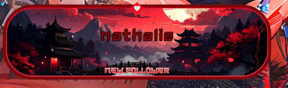
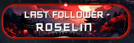

# 🎨 Alert Twitch

Benvenuto! Questa repository raccoglie alcune grafiche personalizzate pensate per abbellire il canale Twitch.

Qui trovi tutto quello che serve per mostrare degli overlay animati durante le live — come quando qualcuno inizia a seguire il canale o diventa subscriber.

---

## 📸 Anteprime

Ecco come appaiono le due grafiche:

  
  

---

## ✨ Cosa c'è dentro

- **Nuovo follower / subscriber** — un overlay che appare quando qualcuno segue o si iscrive al canale, con il nome animato lettera per lettera.
- **Ultimo follower** — un widget sempre visibile che mostra in tempo reale il nome dell'ultima persona che ha seguito.

---

Fatto con amore per la live. 🎮
